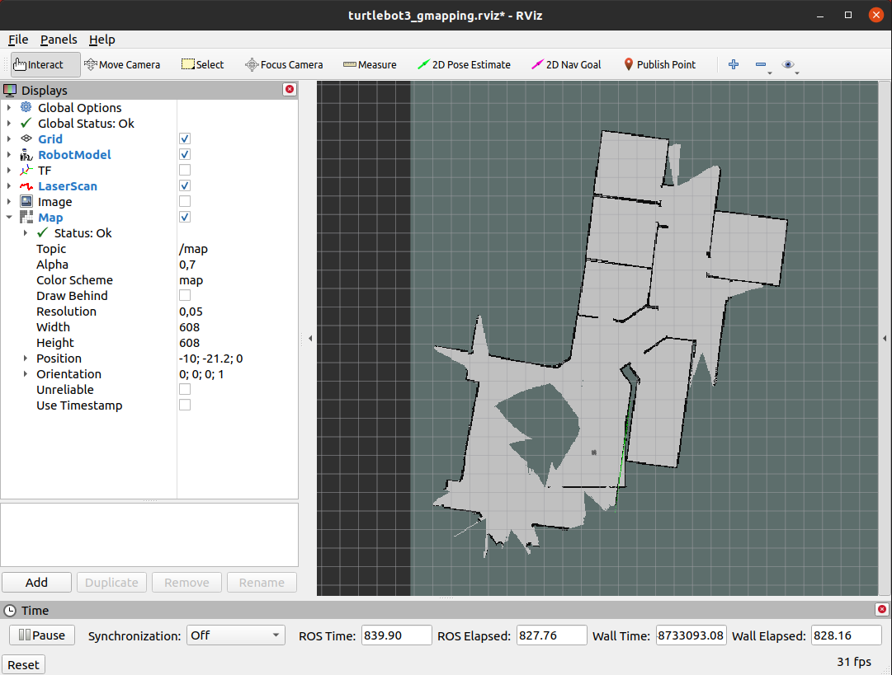
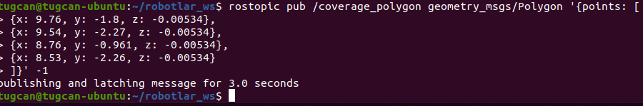
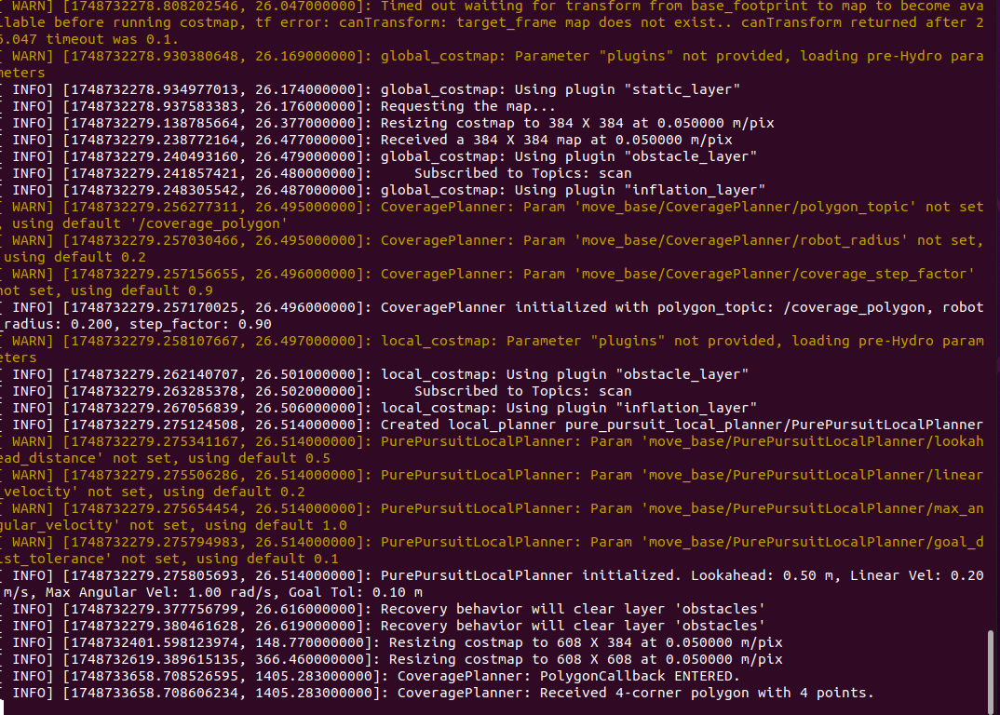
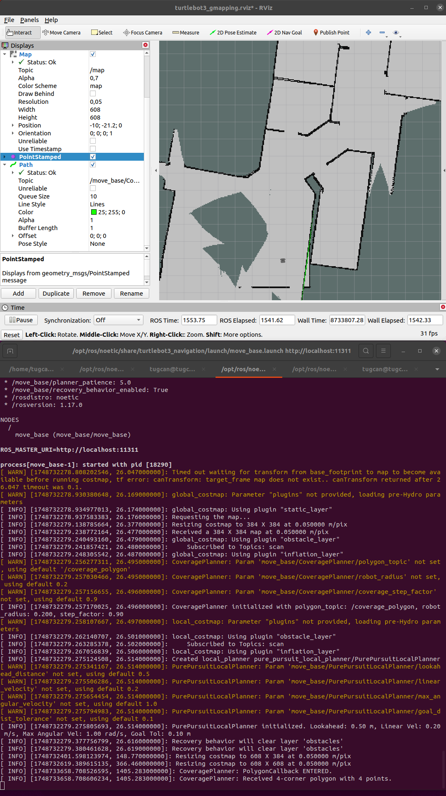
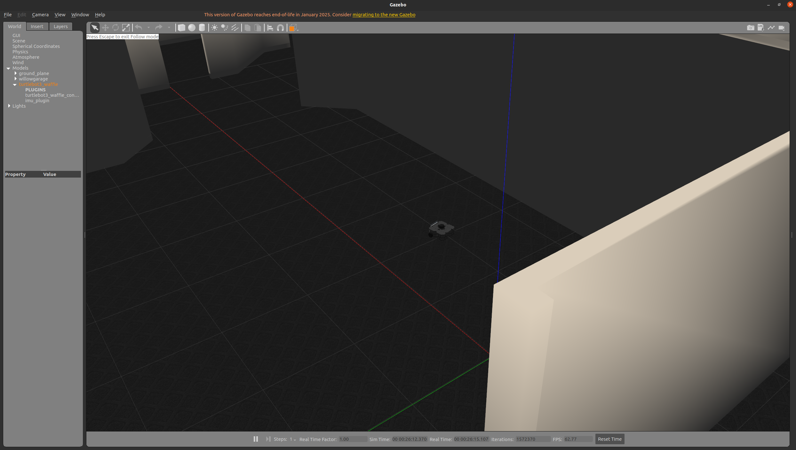
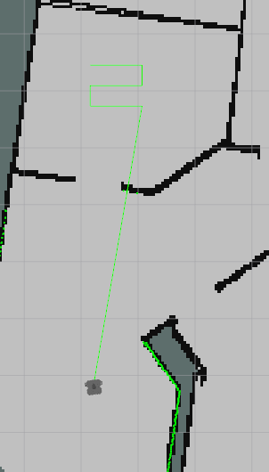
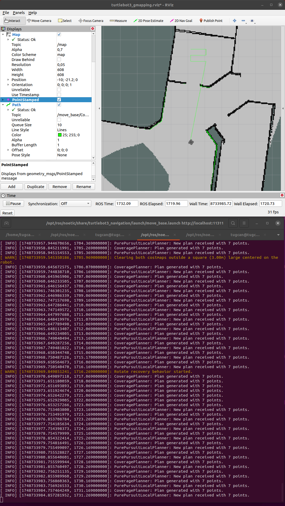
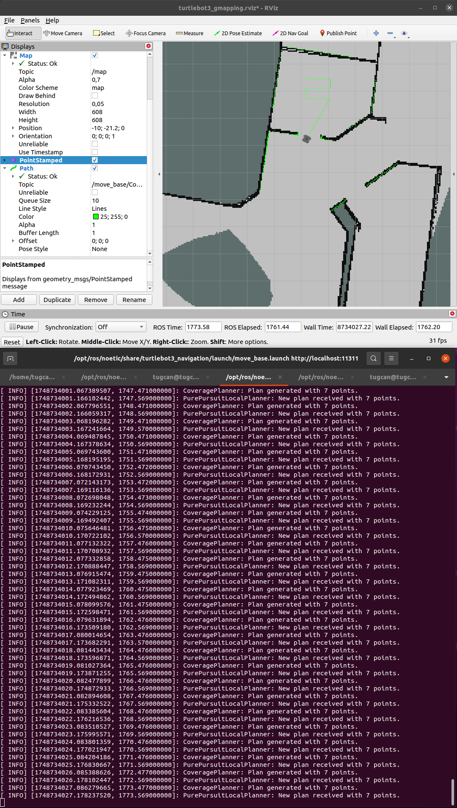
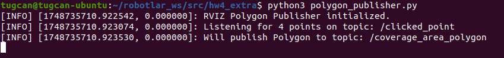

# ROS Navigation Plugins

This project contains ROS navigation plugins developed for **BLM6191 Robots – Assignment 4**. It consists of three main ROS packages:

* a global planner (`coverage_planner`)
* a local planner (`pure_pursuit_local_planner`)
* an auxiliary Python script (see below)

## Overview

### 1. Global Planner: `coverage_planner`

This plugin implements the `nav_core::BaseGlobalPlanner` interface.  
Its main purpose is to generate a **full-coverage path** inside a four‑corner area defined by a `geometry_msgs/Polygon` message, taking the specified robot radius into account.  
The resulting path follows a simple **boustrophedon** (zig‑zag) pattern.

**How it works**

1. Listens on the ROS topic `/coverage_area_polygon` for a polygon message containing four corner points.  
2. Computes an effective scanning area using the polygon’s bounding box, the `robot_radius`, and the `coverage_step_factor`.  
3. Calculates the zig‑zag way‑points that the robot should traverse within this area.  
4. Publishes the generated path on `/move_base/CoveragePlanner/coverage_plan` as a `nav_msgs/Path`, making it available to the `move_base` stack.

### 2. Local Planner: `pure_pursuit_local_planner`

This plugin implements the `nav_core::BaseLocalPlanner` interface and uses the **Pure Pursuit** path‑tracking algorithm described by R. Craig Coulter.

**How it works**

1. Receives the `global_plan_` generated by the global planner.  
2. Retrieves the robot’s current pose via `costmap_2d::Costmap2DROS::getRobotPose`.  
3. On the global plan, selects a look‑ahead point located `lookahead_distance_` ahead of the robot (interpolating between path segments if necessary).  
4. Computes the required curvature to reach that point:  

   ```math
   curvature = \frac{2 \; y_{error}}{L_{actual}^2}
   ```

5. Generates linear and angular velocity commands in `geometry_msgs/Twist` format using the calculated curvature and the predefined `linear_velocity_`.  
   *Angular velocity is limited by `max_angular_velocity_`.*  
6. Stops the robot when it is within `goal_dist_tolerance_` of the final point on the global plan.

## Dependencies

The following ROS packages must be installed (they are included in a standard TurtleBot3 setup):

* `roscpp`
* `nav_core`
* `geometry_msgs`
* `costmap_2d`
* `pluginlib`
* `nav_msgs`
* `tf2_ros`, `tf2_geometry_msgs`
* `angles`
* `base_local_planner`
* `turtlebot3_gazebo` (for simulation)
* `turtlebot3_slam` (for SLAM, e.g. `gmapping`)
* `turtlebot3_navigation` (for `move_base` and configs)
* `slam_gmapping` (if not already installed)

## Installation

1. Copy the `coverage_planner` and `pure_pursuit_local_planner` packages into `robotlar_ws/src`.  
2. Make sure the `turtlebot3_simulations` package is installed.  
3. Build your Catkin workspace:

   ```bash
   cd ~/catkin_ws
   catkin_make
   source devel/setup.bash
   ```

## Running the Demo

The steps below show an example run with a **TurtleBot3 Waffle** in the **Willow Garage** world.

1. **Start Gazebo simulation** (new terminal):

   ```bash
   export TURTLEBOT3_MODEL=waffle   # or burger, waffle_pi
   roslaunch turtlebot3_gazebo turtlebot3_willowgarage.launch
   ```

2. **Start SLAM (mapping)** (new terminal):

   ```bash
   export TURTLEBOT3_MODEL=waffle
   roslaunch turtlebot3_slam turtlebot3_slam.launch
   ```

3. **Manually drive the robot to build a map**  
   (e.g. with `turtlebot3_teleop_key`) until at least two rooms are mapped.

4. **Launch `move_base` with the custom planners** (new terminal)  
   Edit `move_base.launch` inside `turtlebot3_navigation` as follows:

   ```xml
   <launch>
     <node pkg="move_base" type="move_base" respawn="false" name="move_base" output="screen">
       <param name="base_global_planner" value="coverage_planner/CoveragePlanner"/>
       <param name="base_local_planner" value="pure_pursuit_local_planner/PurePursuitLocalPlanner"/>

       <rosparam ns="move_base/CoveragePlanner">
         <param name="polygon_topic"        value="/coverage_area_polygon"/>
         <param name="robot_radius"         value="0.15"/>
         <param name="coverage_step_factor" value="0.8"/>
       </rosparam>

       <rosparam ns="move_base/PurePursuitLocalPlanner">
         <param name="lookahead_distance"   value="0.4"/>
         <param name="linear_velocity"      value="0.15"/>
         <param name="max_angular_velocity" value="1.0"/>
         <param name="goal_dist_tolerance"  value="0.05"/>
       </rosparam>

     </node>
   </launch>
   ```

   Then launch `move_base`:

   ```bash
   export TURTLEBOT3_MODEL=waffle
   roslaunch turtlebot3_navigation move_base.launch
   ```

   *Screenshot: planners initialized*  
   

5. **Publish the coverage‑area polygon**

   *Method 1 – `rostopic pub`* (new terminal)  
   Pick four corner points in RViz and adapt:

   ```bash
   rostopic pub /coverage_area_polygon geometry_msgs/Polygon '{points: [
     {x: X1, y: Y1, z: 0.0},
     {x: X2, y: Y2, z: 0.0},
     {x: X3, y: Y3, z: 0.0},
     {x: X4, y: Y4, z: 0.0}
   ]}' -1
   ```

   Example:

   ```bash
   rostopic pub /coverage_polygon geometry_msgs/Polygon '{points: [
     {x: 9.76, y: -1.8,  z: -0.00534},
     {x: 9.54, y: -2.27, z: -0.00534},
     {x: 8.76, y: -0.961,z: -0.00534},
     {x: 8.53, y: -2.26, z: -0.00534}
   ]}' -1
   ```

   *Method 2 – helper Python node*  
   Run:

   ```bash
   python3 ~/hw4_extra/polygon_publisher.py
   ```

   Then select four points with RViz’s **“Publish Point”** tool.

6. **Visualize the global plan in RViz**  
   *Add → By topic → `/move_base/CoveragePlanner/coverage_plan`.*

7. **Send a navigation goal (2D Nav Goal)**  
   Click inside (or near) the published polygon.

8. **Watch the robot follow the generated path**

## Example Output and Behavior

For quick testing, open separate terminals and run:

```bash
roslaunch turtlebot3_gazebo turtlebot3_willowgarage.launch      # Gazebo
roslaunch turtlebot3_slam turtlebot3_slam.launch                # SLAM
roslaunch turtlebot3_navigation move_base.launch                # planners
roslaunch turtlebot3_teleop turtlebot3_teleop_key.launch        # teleop
```

After SLAM mapping, the robot was driven as shown:



The following polygon was published:



`move_base` confirms that the planners are active:



Before giving a 2D Nav Goal:



Robot position on the main map:



The planners guide the robot around the selected room:



Terminal output shows each step:



Finally, the robot finishes covering the room:



> **Note** Choose polygons large enough; very small areas may trap the TurtleBot.

When the Python script is used, it automates polygon publication and outputs:



### Running a Second Time

After the first plan is finished (or the robot is stopped), giving a new **2D Nav Goal** triggers `CoveragePlanner` to generate a fresh coverage path starting from the robot’s current pose.

## Conclusion

With these custom global and local planners, full‑coverage navigation has been successfully demonstrated in the TurtleBot3 simulation. `CoveragePlanner` can produce complete coverage paths for a defined polygonal area, and `PurePursuitLocalPlanner` follows those paths effectively. The auxiliary Python script removes the need for manual polygon publication.
